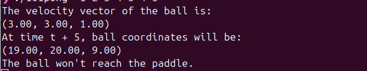
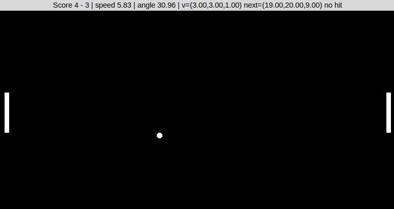

<h1 align="center" id="title">pong</h1>

<p align="center"></p>

<p id="description">pong is a python game which is inspired by the real Pong game and displays several ball statistics with a graphical interface</p>

<h2>Project Screenshots:</h2>





  
  
<h2>Features</h2>

Here're some of the project's best features:

*   velocity vector
*   ball coordinates
*   graphical interface

<h2>🛠️ Installation Steps:</h2>

<p>1. # pong_python Simple Pong-inspired visualization used to display the results of the `101pong` math assignment.</p>

<p>2. ## Requirements - Python 3.x with the Tkinter module available (on Debian/Ubuntu install `python3 python3-tk` on Fedora `python3 python3-tkinter`</p>

<p>3. ## How to run Clone the repository then choose one of the two equivalent entry points below .</p>

<p>4. ### Using Python directly ```bash python3 101pong.py x0 y0 z0 x1 y1 z1 n ``` - `x0` `y0` `z0`: ball coordinates at time `t - 1` - `x1` `y1` `z1`: ball coordinates at time `t` - `n`: non-negative integer time shift</p>

<p>5. ### Using the provided executable ```bash make # creates ./101pong ./101pong x0 y0 z0 x1 y1 z1 n ``` The program prints the velocity vector future coordinates at `t + n` and whether the ball will hit the paddle (plus the incidence angle). A Tk window also opens with a small Pong game that visualizes the current computation. Controls: left paddle uses `W/S` right paddle uses the Up/Down arrows.</p>
